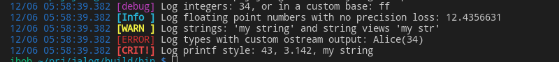

# Jalog

[](https://isocpp.org/) [](https://en.wikipedia.org/wiki/C%2B%2B#Standardization) [](https://opensource.org/licenses/MIT)

Just Another Logging library for C++17.

## Features

* Synchronous and asynchronous logging
* Five fixed log levels: Debug, Info, Warning, Error, Critical
* Custom log scopes (categories).
* Custom log sinks and some predefined ones.
* Allows multiple independent loggers
* Thread safe
* Optimized for (in that order):
    * Performance
    * Ease of use
    * Compilation time
* Logging styles:
    * Jalog-style: `log("This is Jalog: ", 12, " and ", 3.141592);`
    * `std::ostream`-like: `log << "This and " << 42;`
    * `printf`-like: `log("Crushing it since %d", 1971);`
    * raw (which allows you to provide your own style, say `std::format`)

## Example

A small snippet showcasing some of the library's features:

*It also exists as a complete and buildable example [here](example/e-BasicShowcase.cpp).*

```c++
jalog::Instance jl;
jl.setup().add<jalog::sinks::ColorSink>();

JALOG(Debug, "Log integers: ", 34, ", or in a custom base: ", jalog::base<16>(255));
JALOG(Info, "Log floating point numbers with no precision loss: ", 12.4356631);

std::string str = "my string";
std::string_view sv = std::string_view(str).substr(0, 6);
JALOG(Warning, "Log strings: '", str, "' and string views '", sv, "'");

Person alice = {"Alice", 34};
JALOG(Error, "Log types with custom ostream output: ", alice);

JALOG_PRINTF(Critical, "Log printf style: %d, %.3f, %s", 43, 3.14159, str.c_str());
```

This will produce an output similar to this:



## Documentation

* [Adding Jalog to your project](doc/how-to-add.md)

## Building and Usage

There is an accompanying `CMakeLists.txt` file in the repo. Use CMake to generate project or make files for your desired platform and compiler.

The library uses [CPM.cmake](https://github.com/cpm-cmake/CPM.cmake) to manage its dependencies and the best way to use it is as a CPM.cmake pacakge.

## Contributing

Issues and pull requests are welcome.

## License

This software is distributed under the MIT Software License.

See accompanying file LICENSE or copy [here](https://opensource.org/licenses/MIT).

Copyright &copy; 2021 [Borislav Stanimirov](http://github.com/iboB)
